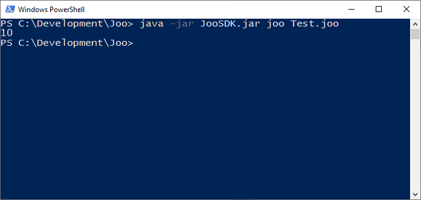
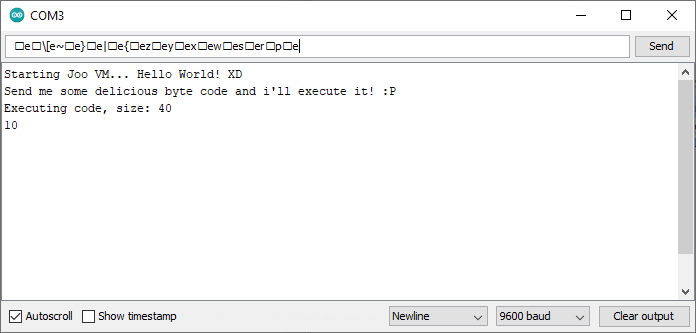

Joo is a programming language created to run on machines with extremely low resources like microcontrollers.

I had this idea while playing around with the [Arduios](https://github.com/JohnsProject/Arduios) and [Retruino](https://github.com/JohnsProject/Retruino), the arduios has a lot of potential on it's own but i just wanted more.
And this project is the result of that.

I've developed the first functional version of it as a weekend hack a while ago, so there's quite a lot to do as it has a lot of potential and the compiler and virtual machine code could be a lot better.

Since the code wasn't that good i wanted to refactore it before publishing, the new code is in the `refactoring` branch, but there's just so much to do that i decided to publish it as it is, because as i already said it has a lot of potential and if i publish it maybe a community will grow and it will be developed faster and in ways i can't even dream about right now!

##### [Join our discord!](https://discord.gg/9ZDPcT5mxg)

## Using the Joo SDK

To start download the SDK at `builds/JooSDK.jar`, then create a new file called `Test.joo` in the same folder as the SDK file and paste the code below.

```
include StandartLibrary.joo

int helloWorld = 10

function Start
	call Print helloWorld
endFunction
```

Then execute it using the `joo` command.



The commands supported are

* `joo <file>` If the specified file is a `.cjoo` file, executes the code. If the file is a `.joo` file compiles it then executes it.

* `joo -compile <file>` Compiles the `.joo` file, and generates a `.cjoo` file in the same folder.

* `joo -create <file>` Creates a `.joo` file at the specified path with the Joo template code.

* `joo -help` Shows the Joo SDK help message.

## Programming the Arduino UNO with Joo

[Arduios](https://github.com/JohnsProject/Arduios) allows you to use a sketch in different use cases, without having to upload a new one every time. But joo is on a whole new level, you just need to upload the ArduinoJooVM once, then you can upload any joo binary using the serial port of the arduino and the vm will execute it.

You're probably thinking, how does it work? The Arduino UNO only has 2KB of ram. Well, that's where the magic happens, if you wan't to understant how it works, read [The Joo byte code language](#the-joo-byte-code-language).

To start upload the ArduinoJooVM sketch at `builds/ArduinoJooVM/ArduinoJooVM.ino`. After uploading open the serial monitor and  copy the byte code in the `Test.cjoo` file created in [Using the Joo SDK](#using-the-joo-sdk) and send it.



## The Joo programming language
Is a clean, fast, static typed, general purpose language. 

Code files are saved as `.joo` files that get compiled to `.cjoo` files.

Comments look like this

```
# this is a single line comment

##
this is a 
multi-line comment
##
```

Right now 4 data types are supported `int`, `fixed` (fixed point 8.8 bytes), `bool` and `char`. I'm planning to add `string` someday. I implemented fixed point instead of floating point for performance reasons.

```
int myInt # it's not necessary to assign a value
int myIntWithValue = 50

fixed myFixed = 12.34
bool myBool = true/false 1/0
char myChar = 'A'
```

A `constant` is a value that can't be changed, it doesn't have a type, the compiler just replaces it's name with it's value at compile time.

```
constant MY_CONSTANT = 10

int myInt = MY_CONSTANT

```

The `include` keyword allows to add code from other `.joo` files in the same directory or subdirectories using their name. The compiler just adds the code of the file to the end of the code in the current file.

```
include MyLibrary.joo
include Directory/MyLibrary.joo
```

Every code, except for variable and constant declarations and includes, needs to be inside a `function`, at the moment the first function in the code is the one the virtual machine calls to start executing. Functions can have up to 6 parameters.

```
int myInt
bool myBool

function Start
	call MyFunction myInt myBool # executes MyFunction with the specified arguments
	repeatFunction # restarts the execution of the function
endFunction

function MyFunction int _myInt bool _myBool
	# write code here
endFunction

```

All 4 supported data types can also be used as a array. The max length of array is `54`.

```
int:10 myArray # declares a array with size 10

function Start
	myArray:5 = 25 # assigns the value 25 to the 5th index of the array.
endFunction
```

Conditions are also supported with the `if`, `elseIf` and `else` keywords.

```
int firstValue = 10
int secondValue = 5

function Start
	if firstValue == secondValue
		# code goes here
	elseIf firstValue == 8
		# code goes here
	else
		# code goes here
	endIf
endFunction
```

Only binary operators are supported, means you need 2 variables, the same variable in both sides of the operator or a value after the operator.

````
myInt + 5
myInt1 + myInt2
myInt1 -= myInt1 
````

The operators implemented in the standart library are

```
operator <= int|fixed 				# smaller-equals comparator
operator >= int|fixed 				# bigger-equals comparator
operator < int|fixed 				# smaller comparator
operator > int|fixed 				# bigger comparator
operator == int|fixed|bool|char 		# equals comparator
operator != int|fixed|bool|char 		# not equals comparator
operator = int|fixed|bool|char 			# assign operator 
operator =+ int|fixed|bool 			# positive assign operator
operator =- int|fixed|bool 			# negative assign operator
operator =! int|fixed|bool 			# invert assign operator
operator + int|fixed 				# add operator
operator - int|fixed 				# subtract operator
operator * int|fixed 				# multiply operator
operator / int|fixed 				# divide operator
operator % int 					# modulus operator
operator & int 					# bitwise AND operator
operator ^ int 					# bitwise XOR operator
operator | int 					# bitwise OR operator
operator ~ int 					# bitwise NOT operator
operator << int 				# bit shift left operator
operator >> int 				# bit shift right operator
```

It's possible to declare custom operators and native functions. Native functions are functions that are implemented in the virtual machine, so it allows you to call native code from joo as well as change the value of the variables passed as arguments.
At the moment if you have custom operators or native functions you have to modify the vm and recompile it so you can execute your stuff.

```
# The supported types are separated with a |
operator == int|fixed|bool|char
operator += int|fixed

native HelloWorld int|fixed bool int|char
# native functions are called like other functions call HelloWorld myInt myBool myInt
```

The joo programming laguage has a standart library, even if very bare bones right now, it has common used operators and native functions that are already implemented in the default build of the virtual machine. 

You can include the standart library using 

```
include StandartLibrary.joo
```

##### Known limitations

Most of the limitations are a result of the extremely efficient byte code.

* 64 variables + functions
* 6 parameters/function
* 54 max array size
* Function call arguments must be variables.
* Number type variable declaration doesn't support negative values.

Well, you know, i'm lazy and don't exactly know how to explain things, specialy since i've never created a programming language before and there's so much to explain, so take a look at the test code at `src/test/resources` as well as the compiler and virtual machine code. It will help you get a better understanding of the language and how the magic happens.

## The Joo byte code language

The joo byte code language uses single characters/bytes in the range `0 - 127` to represent the compiled code
executed by the virtual machine.

```
* 0 - 0		end of file
* 1 - 65  	variable and function names
* 66 - 72  	parameter names
* 73 - 127 	array indices
* 91 - 127 	numbers, keywords and types
* 1 - 127 	operators, native functions
```

So let's say you have this code


```
int myInt
bool myBool

function Start
	myInt = 10
	myBool = true
	call MyFunction myBool myInt
endFunction

function MyFunction bool _testBool int _testInt
	_testBool = false
	_testInt = 5
endFunction

```

Since in byte code the names of the variables and functions a.k.a components are represented in as 1 number in the range `1 - 65` the  byte code the names are

* `myInt` = 1
* `myBool` = 2
* `Start` = 3
* `MyFunction` = 4

The `MyFunction` parameter names are

* `_testBool` = 66
* `_testInt` = 67

so the byte code of the code above looks like

```
int 1
bool 2

function 3
	1 = 10
	2 = true
	call 4 2 1
endFunction

function 4
	66 = false
	67 = 5
endFunction

```

Of course the keywords are also replaced by their single byte representation. The `MyFunction` parameters don't need to be declared in the byte code since the type and parameter count checks happen at compile time.

Pretty smart isn't it? \*guy taping head meme\*

## The Joo virtual machine
The language can be easily extended with `operator` and `native` function libraries. But their functionality needs to be implemented in the virtual machine.

To create custom operators, first of all you need to declare them in code

```
operator += int|fixed
operator -= int|fixed
operator *= int|fixed
```

And then you need to implement it in the virtual machine. To do so go to the `interpretVariableOperation` method, declare the constant with the byte code name of your operator above it, and then add the case to the switch. The default vm already has the standart library's operators implemented, so you have base on how to do it. Note that the order of the declarations matter as they change the byte code name. In the example above the `+=` has the byte code name `0 + OPERATORS_START`, the `-=` = `1 + OPERATORS_START` and so on. If you've included the standart library you need to continue the byte code names of the standart library. 

Same goes for the native functions.

